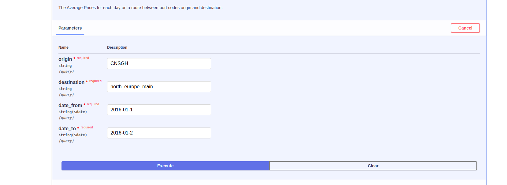
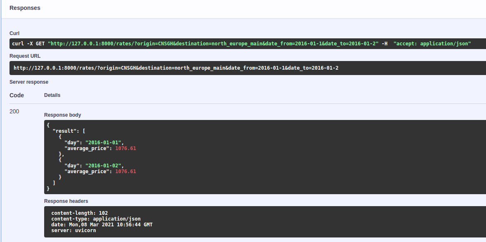

# Rates - Using FastAPI & Python 3.8

## Description:
Why FastAPI?
1. Speed (Built over ASGI instead of WSGI).
2. Detect any invalid data type at the runtime and returns the reason for bad inputs.
3. Generates the documentation on the go.
4. Nice GUI - Developer experience.
5. Suitable with ML based projects.

## **Setup:**

1. git clone https://github.com/yogeshrana18/rates.git
2. cd rates (Get inside of rates dir).
3. Setup config.py (for DB and CurrencyExchange key id).
4. python3.8 -m venv .env (Create Virtual Environment).
5. pip3 install -r requirements.txt (Install all dependencies).
6. uvicorn app.main:app --reload (Run the server with command).
7. Run tests.py (python3.8 -m app.test.tests)

## Example for Test API (Using UI):

1. Go to http://127.0.0.1:8000/docs.
2. Choose api from the list and click Try it out.

3. Pass parameter and Execute.

4. You are ready to use any api now!.

## Batch Processing Problem Task:

I would like to make a batch, where a collection of large data will insert into the batch and load into the work queue. Now in order to get performance, Inside work queue, we will divide our input data of large amount into chunks and store into multiple block sizes. After that, we will pull that data from our work queue of blocks and push it to process into a thread. Processing on data to thread could be done in serial processing or parallel processing. But to optimize our tasks in less amount of time we will choose multiple threads (parallel processing). Any system that has more threads will be working faster on that. Lastly, it generates results or saves them to the database. So that is how I can work on a large amount of data.

Time Took: It took 9 - 10 hours

